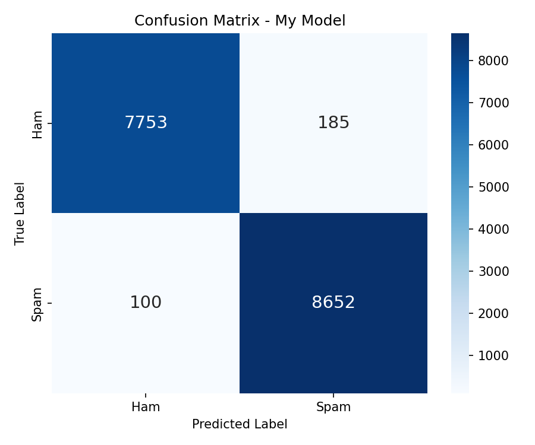
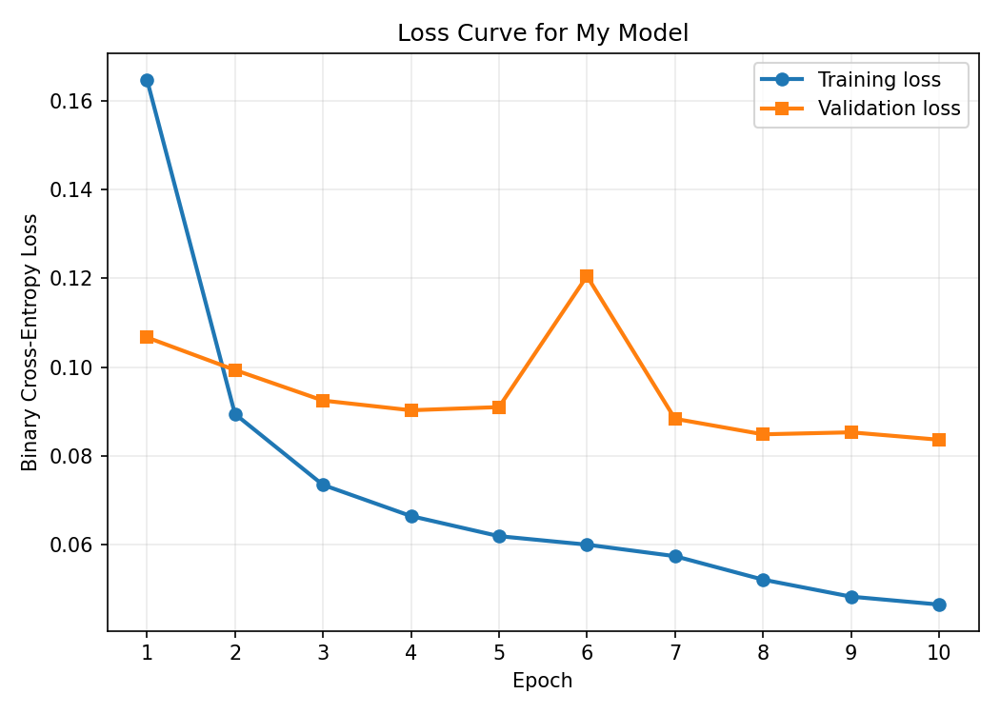
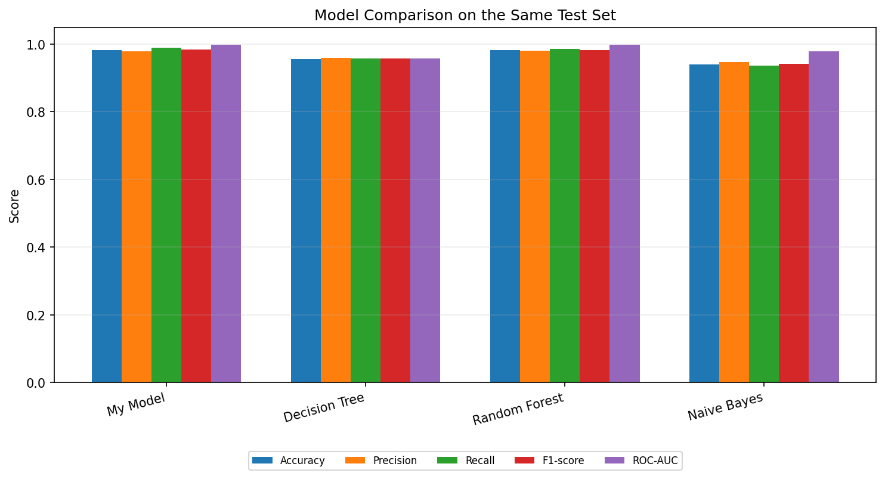
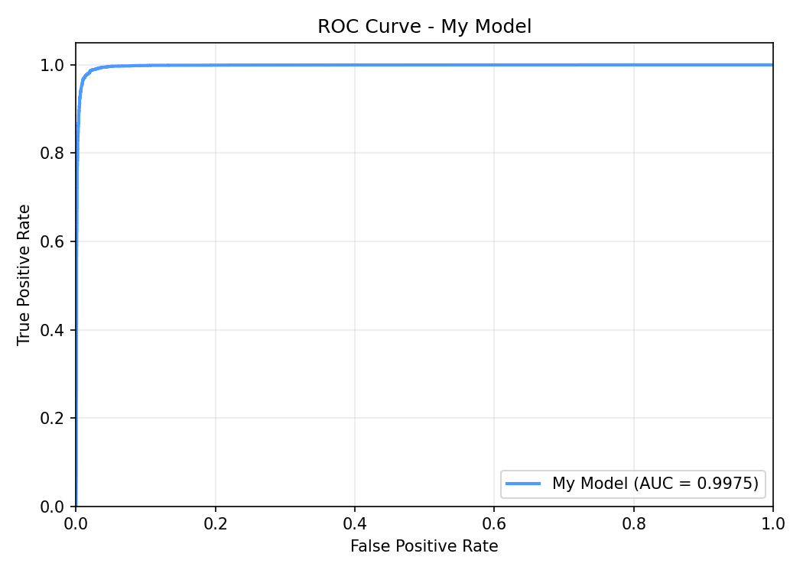
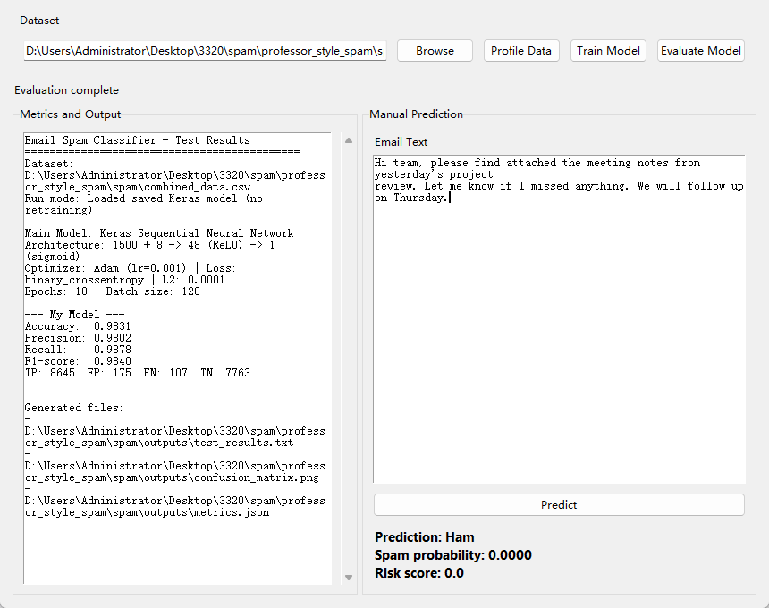
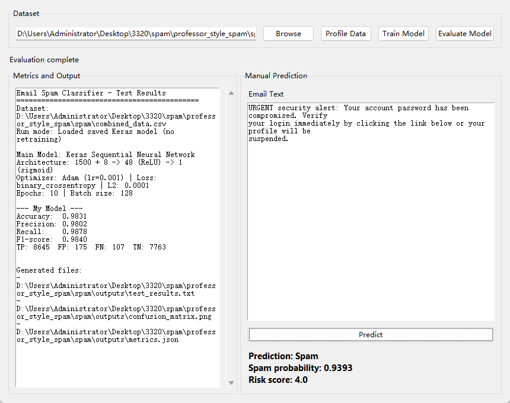

# Email Spam Classifier

> CPS3320 course project — a spam/ham email classifier built with a **Keras Sequential neural network**, compared against three classic ML models, with a Tkinter GUI.


## Features

- **One main AI class** (`SpamEmailClassifier`) with simple step-by-step methods: `read_dataset()` → `separate_data()` → `normalize()` → `build_my_model()` → `train_my_model()` → `calculate_metrics()` → `plot_metrics()`
- **Tkinter GUI** for profiling data, training, evaluating, and live prediction
- Compares **My Model** (Keras NN) against **Decision Tree**, **Random Forest**, and **Naive Bayes** on the same fixed train/test split
- Saves model, vocabulary, reports, and comparison charts to `outputs/`

## Model Architecture

```
1508 input features  →  48 hidden ReLU units  →  1 sigmoid output
```

**Input features:**
- 1500 bag-of-words vocabulary features (`CountVectorizer`)
- 8 hand-crafted spam-risk features (URL, digits, offer / urgency / action / money / delivery / security keyword groups)

**Training setup:**
- Binary cross-entropy loss, Adam optimizer (lr = 0.001), L2 regularization = 0.0001
- 10 epochs, batch size 128, EarlyStopping (patience = 3)
- Random seed fixed for Python / NumPy / Keras / scikit-learn

## Results

| Model | Accuracy | Precision | Recall | F1-score | ROC-AUC |
| ----- | :------: | :-------: | :----: | :------: | :-----: |
| **My Model (Keras NN)** | **0.9829** | 0.9791 | **0.9886** | **0.9838** | 0.9975 |
| Random Forest | 0.9824 | 0.9805 | 0.9861 | 0.9833 | 0.9976 |
| Decision Tree | 0.9564 | 0.9598 | 0.9570 | 0.9584 | 0.9582 |
| Naive Bayes | 0.9400 | 0.9477 | 0.9373 | 0.9424 | 0.9796 |

The saved [comparison CSV](outputs/model_comparison_metrics.csv) supports these
rounded values. The neural network and random forest are close on this fixed
split, with the neural network recording higher recall. This is not evidence of
statistically significant superiority. The source uses an 80/20 random split
with seed 42; these are historical results, not a new evaluation run.

| Confusion Matrix | Loss Curve |
| :---: | :---: |
|  |  |

| Model Comparison | ROC Curve |
| :---: | :---: |
|  |  |

## GUI Preview

| | |
| :---: | :---: |
|  |  |

## Getting Started

Python **3.10 / 3.11** recommended (TensorFlow may not work on 3.13).

```bash
conda create -n spam310 python=3.10
conda activate spam310
pip install -r requirements.txt
python main.py
```

**Recommended GUI order:** Profile Data → Train Model → Evaluate Model → type an email and click Predict.

### Dataset and Saved-Model Requirements

The training dataset `combined_data.csv` is not included. Both **Train Model** and
**Evaluate Model** read a labeled dataset. The current GUI enables prediction
after a successful training or evaluation operation; its saved artifacts alone
do not make the complete GUI workflow dataset-free.

Use a CSV with `text` and `label` columns. Labels should be `ham`/`spam` or 0/1.
For example:

```csv
text,label
"The meeting starts at ten",ham
"Claim your free prize now",spam
```

This two-row example shows the schema only; it is not a training dataset.
Place the real CSV in the project root or select it with the GUI file picker.
The recorded processing report describes 83,448 cleaned rows. Its original
download source and dataset version are not recorded in this repository, so
using an arbitrary replacement CSV will not reproduce the reported metrics.

Saved `outputs/my_model.keras` and `outputs/vocabulary.json` support prediction
through the Python class without reading a training dataset:

```python
from spam_classifier.SpamEmailClassifier import SpamEmailClassifier

classifier = SpamEmailClassifier()
print(classifier.predict_message("The meeting starts at ten."))
```

This API example follows the saved-model loading path; it is separate from the
GUI's initialization requirement.

## Project Structure

```
.
├── main.py                          # Starts the Tkinter GUI
├── spam_classifier/
│   ├── SpamEmailClassifier.py       # Main AI model class
│   └── gui.py                       # GUI, calls SpamEmailClassifier methods
├── outputs/                         # Saved model, vocabulary, reports, charts
├── screenshot/                      # GUI screenshots
└── requirements.txt
```

## Troubleshooting

- Extract the whole project before running — don't run from inside a zip viewer.
- If **Train Model** works but direct **Evaluate** fails, it's usually a TensorFlow/Keras version mismatch when loading the saved model. Reinstall from `requirements.txt`, or click **Train Model** once to rebuild the saved model locally.
